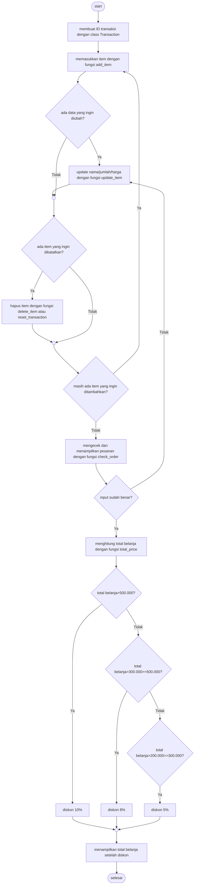

# Pacmann.ai-PythonProject
Project membuat sistem kasir swalayan menggunakan Python

## Latar Belakang
Swakasir merupakan sistem kasir swalayan, sesuai dengan namanya, "Swakasir", di mana pelanggan dapat mencantumkan barang yang akan dibeli (nama, jumlah barang dengan harga yang telah ditentukan) disertai fitur yang lainnya.

Ketentuan yang diberlakukan yaitu: Modular code, clean code (PEP8), dokumentasi Docstring (menjelaskan makna code), try-error untuk track error, dapat menggunakan library Python

## Persyaratan atau Obyektif
Alur belanja pada Swakasir adalah sebagai berikut:
1. Customer membuat ID transaksi customer;
2. Customer memasukkan nama, jumlah dan harga barang yang dibeli;
3. Jika terjadi kesalahan memasukkan nama, jumlah maupun harga barang, pelanggan bisa memperbaikinya dengan:
  a. mengubah nama: update_item_name;
  b. mengubah jumlah: update_item_qty;
  c. mengubah harga: update_item_price.
4. Jika batal membeli, pelanggan bisa:
  a. menghapus pilihan belanjanya dengan delete_item(), atau;
  b. reset seluruh transaksi dengan reset_transaction().
5. Jika customer sudah selesai berbelanja online, namun masih ragu apakah harga & nama barang sudah benar atau belum, bisa melakukan cek dengan check_order(), dengan ketentuan:
  a. mengeluarkan pesan "**Pesanan sudah benar**" berarti tidak ada kesalahan input;
  b. mengeluarkan pesan "**Terdapat kesalahan input data**" berarti terdapat kesalahan input;
  c. mengeluarkan output pemesanan apa saja yang sudah dibeli.
6. Customer bisa menghitung total belanja yang sudah dibeli, dengan method total_price. Terdapat ketentuan:
  a. jika total belanja > Rp. 200.000, maka mendapat diskon 5%;
  b. total belanja > Rp. 300.000, maka diskon 8%;
  c. total belanja  > Rp. 500.000, maka diskon 10%.
  

