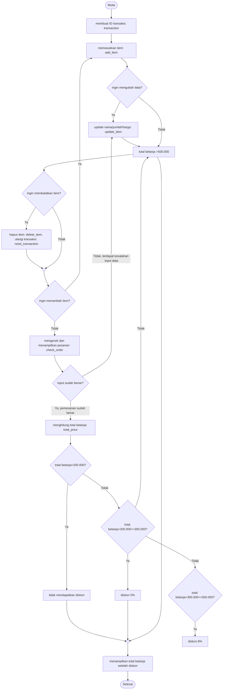

# Pacmann.ai-PythonProject Super Cashier
Project membuat sistem kasir swalayan menggunakan Python

## Latar Belakang
Super cashier merupakan sistem kasir swalayan, di mana pelanggan dapat mencantumkan barang yang akan dibeli (nama, jumlah barang dengan harga yang telah ditentukan) disertai fitur lainnya.

Ketentuan yang diberlakukan yaitu: Modular code, clean code (PEP8), dokumentasi Docstring (menjelaskan makna code), try-error untuk track error, dapat menggunakan library Python

## Persyaratan atau Obyektif
Alur belanja pada Swakasir adalah sebagai berikut:
1. Customer membuat ID transaksi customer;
2. Customer memasukkan nama, jumlah dan harga barang yang dibeli;
3. Jika terjadi kesalahan memasukkan nama, jumlah maupun harga barang, pelanggan bisa memperbaikinya dengan:
  a. mengubah nama: update_item_name;
  b. mengubah jumlah: update_item_qty;
  c. mengubah harga: update_item_price.
4. Jika batal membeli, pelanggan bisa:
  a. menghapus pilihan belanjanya dengan delete_item(), atau;
  b. reset seluruh transaksi dengan reset_transaction().
5. Jika customer sudah selesai berbelanja online, namun masih ragu apakah harga & nama barang sudah benar atau belum, bisa melakukan cek dengan check_order(), dengan ketentuan:
  a. mengeluarkan pesan "**Pesanan sudah benar**" berarti tidak ada kesalahan input;
  b. mengeluarkan pesan "**Terdapat kesalahan input data**" berarti terdapat kesalahan input;
  c. mengeluarkan output pemesanan apa saja yang sudah dibeli.
6. Customer bisa menghitung total belanja yang sudah dibeli, dengan method total_price. Terdapat ketentuan:
  a. jika total belanja > Rp. 200.000, maka mendapat diskon 5%;
  b. total belanja > Rp. 300.000, maka diskon 8%;
  c. total belanja  > Rp. 500.000, maka diskon 10%.
  

## Fungsi yang dipakai

###### 1. Customer membuat ID transaksi
   trnsct_123 = Transaction(), memulai class Transaction
   
###### 2. Menambah item yang akan dibeli
   add_item([nama item, jumlah item, harga per item]), menambah barang yang akan dibeli
   nama item(tipe: string)    = nama dari item yang hendak dibeli
   jumlah item(tipe: int)     = jumlah item yang akan dibeli
   harga per item(tipe: int)  = harga/item terkait

###### 3. Mengubah, memperbaiki daftar pembelian
   a. Mengubah nama item
   update_item_name([nama item, update nama item])
    nama item(string)          = nama item yang namanya ingin diganti
    update nama item(string)   = nama baru item
    
   b. Mengubah jumlah item
   update_item_qty([nama item, update jumlah item])
    nama item(string)          = nama item yang jumlahnya ingin diganti
    update jumlah item(int)    = jumlah baru item 
  
   c. Mengubah harga item
   update_item_price([nama item, update harga item])
    nama item(string)          = nama item yang harganya ingin diganti
    update harga item(int)     = harga baru item
   
###### 4. Membatalkan pembelian item
   a. Menghapus salah satu item:
   delete_item(nama item)
    nama item(string)         = nama item yang ingin dihapus
   b. Menghapus semua atau mengulang transaksi
   reset_transaction()
   
###### 5. Melakukan cek / memvalidasi dan menampilkan semua pesanan dalam dictionary
  check_order(), dengan ketentuan:
  a. Jika tidak ada kesalahan input, maka muncul pesan "**Pesanan sudah benar**";
  b. Jika ada kesalahan input, maka muncul pesan "**Terdapat kesalahan input**";
  c. Setelah memvalidasi input, keluarlah output pesanan yang sudah dibeli.
  
###### 6. Setelah pengecekan, customer menghitung total belanja
  total_price(), dengan ketentuan jika:
  a. Total belanja >Rp. 200.000, maka diskon 5%;
  b. Total belanja >Rp. 300.000, maka diskon 8%;
  c. Total belanja >Rp. 500.000, maka diskon 10%.
 
## Demonstrasi
  1. Menambah Item
     input:
     transaksi = c.Transaction()
     transaksi.add_item("Mie Instan", 2, 10_000)
     trnasaksi.add_item("Shampo", 1, 7_500)
     
     output:
     Menamb
