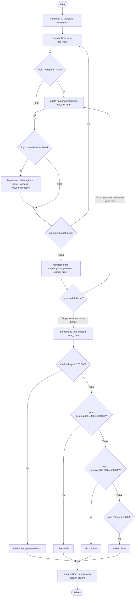

# Pacmann.ai-PythonProject Super Cashier
Project membuat sistem kasir swalayan menggunakan Python

## Latar Belakang
Super cashier merupakan sistem kasir swalayan, di mana pelanggan dapat mencantumkan barang yang akan dibeli (nama, jumlah barang dengan harga yang telah ditentukan) disertai fitur lainnya.

Ketentuan yang diberlakukan yaitu: Modular code, clean code (PEP8), dokumentasi Docstring (menjelaskan makna code), try-error untuk track error, dapat menggunakan library Python.

## Persyaratan
Alur belanja pada Super Cashier adalah sebagai berikut:
1. Customer membuat ID transaksi customer;
2. Customer memasukkan nama, jumlah dan harga barang yang dibeli;
3. Jika terjadi kesalahan memasukkan nama, jumlah maupun harga barang, pelanggan bisa memperbaikinya dengan:
  a. mengubah nama: update_item_name;
  b. mengubah jumlah: update_item_qty;
  c. mengubah harga: update_item_price.
4. Jika batal membeli, pelanggan bisa:
  a. menghapus pilihan belanjanya dengan delete_item(), atau;
  b. reset seluruh transaksi dengan reset_transaction().
5. Jika customer sudah selesai berbelanja online, namun masih ragu apakah harga & nama barang sudah benar atau belum, bisa melakukan cek dengan check_order(), dengan ketentuan:
  a. mengeluarkan pesan "Jumlah & harga item sudah sesuai" berarti tidak ada kesalahan input;
  b. mengeluarkan pesan "Warning: Jumlah/Harga item tidak boleh minus!" berarti terdapat kesalahan input;
  c. mengeluarkan output pemesanan apa saja yang sudah dibeli.
6. Customer bisa menghitung total belanja yang sudah dibeli, dengan method total_price. Terdapat ketentuan:
  a. Jika total belanja <= Rp. 200.000, maka tidak mendapatkan diskon;
  a. total belanja > Rp. 200.000, maka mendapat diskon 5%;
  b. total belanja > Rp. 300.000, maka diskon 8%;
  c. total belanja  > Rp. 500.000, maka diskon 10%.
  

## Fungsi yang dipakai

### 1. Customer membuat ID transaksi  
    trnsct_123 = Transaction(), memulai class Transaction
   
### 2. Menambah item yang akan dibeli  
    add_item([nama item, jumlah item, harga per item])
   * nama item(tipe: string)    = nama dari item yang hendak dibeli  
   * jumlah item(tipe: int)     = jumlah item yang akan dibeli  
   * harga per item(tipe: int)  = harga/item terkait  

### 3. Mengubah nama item  
    update_item_name([nama item, update nama item])
   * nama item(string)          = nama item yang namanya ingin diganti  
   * update nama item(string)   = nama baru item  
    
### 4. Mengubah jumlah item  
    update_item_qty([nama item, update jumlah item])
   * nama item(string)          = nama item yang jumlahnya ingin diganti  
   * update jumlah item(int)    = jumlah baru item  
  
### 5. Mengubah harga item  
    update_item_price([nama item, update harga item])
   * nama item(string)          = nama item yang harganya ingin diganti  
   * update harga item(int)     = harga baru item  
   
### 6. Menghapus item dari daftar belanjaan  
    delete_item(nama item)
   * nama item(string)         = nama item yang ingin dihapus  

### 7. Menghapus semua atau mengulang transaksi  
    reset_transaction()
   
### 8. Melakukan cek / memvalidasi dan menampilkan semua pesanan dalam dictionary  
    check_order()
  Dengan ketentuan:  
  a. Jika tidak ada kesalahan input, maka muncul pesan "Jumlah & harga item sudah sesuai.";  
  b. Jika ada kesalahan input, maka muncul pesan "Warning: Jumlah item tidak boleh minus!" & "Warning: Harga item tidak boleh minus!";  
  c. Setelah memvalidasi input, keluarlah output pesanan yang sudah dibeli.  
  
### 8. Setelah pengecekan, customer menghitung total belanja  
    total_price()
  Dengan ketentuan jika:  
  a. Total belanja <= Rp. 200.000, maka tidak mendapatkan diskon;  
  b. Total belanja >Rp. 200.000, maka diskon 5%;  
  c. Total belanja >Rp. 300.000, maka diskon 8%;  
  d. Total belanja >Rp. 500.000, maka diskon 10%.  
 
## Demonstrasi  
Import module & memasukkan ID transaksi:  
 

  1. Menambah item: add_item()  
     input:  

     output:  
 

  2. Menghapus item: delete_item()  
      input:  
 
      output:  
 
      
  3. Mengatur ulang transaksi: reset_transaction() 
      input: 
 
      output: 
 
      
  4. Mengecek pesanan, memastikan sudah dikosongkan: check_order() 
      input: 
 
      output: 
 
      
  5. Mengecek harga akhir & perolehan diskon 
     * Isi kembali pesanan 
      input: 
 
      output: 
 
     * Melihat harga akhir & perolehan diskon: total_price() 
      input: 
 
      output: 
 
   
  6. Jika ada nilai belanjaan yang tidak wajar (misal jumlah atau harga minus) 
      input: 
 
      output: 

       
  7. Memperbaiki nilai jumlah item: update_item_qty() 
      input: 
 
      output: 
 
       
  8. Memperbaiki nilai harga item: update_item_price() 
      input: 
 
      output: 
 
      input: 
 
      output: 
 
  9. Menambahkan item dengan nama yang sudah ada sebelumnya 
      input: 
 
      output: 

## Kesimpulan  
Modul supercashier.py yang telah dirancang dapat menjalankan berbagai method yang diperlukan sesuai dengan requirement yang diberikan, membantu baik pembeli maupun penjual mulai dari merekap aktifitas transaksinya, melakukan kroscek input, total belanja & capaian diskon dst., dengan catatan:  
* Setiap method yang telah dirancang dapat berjalan sesuai fungsi yang diharapkan;
* Try-branching yang dirancang dapat mengantisipasi nilai tidak wajar dan duplikat yang mungkin terjadi selama input transaksi;
* Code module dirancang dengan kaidah PEP8;
* Modular code (.py), yang terdiri dari berbagai fungsi dengan tugasnya masing-masing.
      
